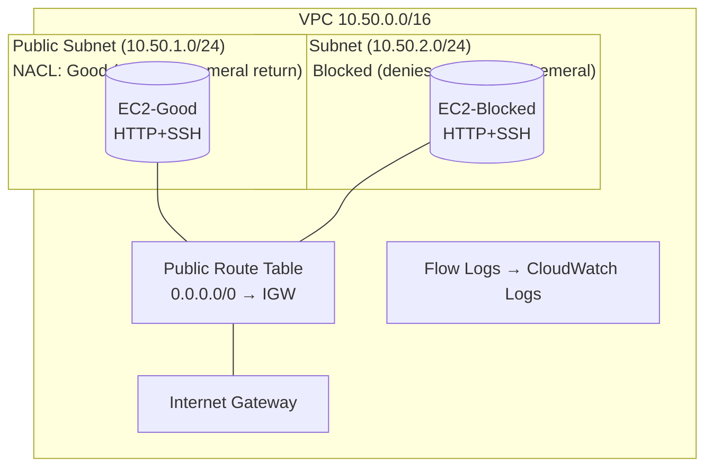

# AWS Networking Lab — Network Security Controls (SGs vs. NACLs)

Learn how **Security Groups (SGs)** and **Network ACLs (NACLs)** behave by deploying a small VPC with two public subnets:
- **Good Subnet** (NACL permits return traffic) → web works ✅
- **Blocked Subnet** (NACL denies outbound ephemeral return) → web breaks ❌

You’ll verify that:
- **Security Groups are stateful** → return traffic is automatically allowed.  
- **NACLs are stateless** → you must explicitly allow traffic **both directions**, including **return ports**.
- **VPC Flow Logs** show **ACCEPT**/**REJECT** entries so you can observe the NACL drops.

> ⚠️ **Costs**: This lab uses 2 EC2 instances, CloudWatch Logs for flow logs, and an Internet Gateway (no NAT). Remove the stack when finished.

---

## 🗺️ Architecture Diagram



---

## 📦 What gets deployed

- **VPC** `10.50.0.0/16`
- **Two public subnets**
  - `10.50.1.0/24` (**Good**) associated to **Good NACL**
  - `10.50.2.0/24` (**Blocked**) associated to **Blocked NACL**
- **Route table** with default route to **IGW** (for both subnets)
- **Security Group** `WebSg`:
  - Inbound: HTTP(80) from `0.0.0.0/0`, SSH(22) from **your IP**, ICMP from VPC CIDR
  - Outbound: **all** (default)
- **NACLs**
  - **GoodNacl**: allows HTTP in + **ephemeral return both ways**
  - **BlockedNacl**: allows HTTP in but **DENIES outbound ephemeral** to demonstrate stateless behavior
- **EC2 instances** (Amazon Linux 2023):
  - `EC2-Good` in Good subnet → serves a simple web page
  - `EC2-Blocked` in Blocked subnet → serves a simple web page
- **VPC Flow Logs → CloudWatch Logs**:
  - Log group: **`/vpc/flowlogs/lab3`**
  - IAM role for VPC Flow Logs delivery
  - Traffic type: **ALL** (you’ll filter for REJECTs when testing)

---

## 🔧 Parameters

- `KeyName` — EC2 key pair for SSH
- `YourIpCidr` — your IP in CIDR form (e.g., `203.0.113.10/32`) for SSH
- `InstanceType` — `t3.micro` by default

---

## 🚀 Deploy

1. AWS Console → **CloudFormation** → **Create stack** → *With new resources*.  
2. Upload `cloudformation/network-security-controls.yaml`.  
3. Set parameters and **Create stack**.  
4. Wait for **CREATE_COMPLETE** → open **Outputs** for:
   - `GoodPublicIP` — public IP of `EC2-Good`
   - `BlockedPublicIP` — public IP of `EC2-Blocked`

---

## ✅ Lab Steps

### 1) Prove SGs are stateful
From your laptop:
```bash
# Works for both instances (SG allows inbound 80; return is automatic)
curl http://<GoodPublicIP>
curl http://<BlockedPublicIP>
```

> Even though we don’t add explicit **egress ephemeral** rules to the **SG**, responses succeed — that’s the **stateful** behavior of Security Groups.

### 2) Prove NACLs are stateless (and see REJECTS in Flow Logs)
Now hit each instance’s web page again and watch the **difference**:

- **Good Subnet** (allowed return):
  ```bash
  curl -I http://<GoodPublicIP>   # Expect 200/301/OK
  ```
- **Blocked Subnet** (denied return):
  ```bash
  curl -I http://<BlockedPublicIP>  # Expect hang/timeout
  ```

**Check Flow Logs**
1. Console → **CloudWatch Logs → Log groups → `/vpc/flowlogs/lab3`**.  
2. Open the newest log stream.  
3. Use **Search** box for `REJECT` to find entries where **destination port** is your client’s **ephemeral port** (e.g., 54000) and **action=REJECT**.  
4. You can also filter by the **Blocked subnet** CIDR `10.50.2.0/24` or the **instance’s private IP**.

### 3) Fix the “Blocked” subnet by adjusting NACL
Console → **VPC → Network ACLs → BlockedNacl**  
- **Outbound rules** → **Add** **ALLOW** for **1024–65535** to `0.0.0.0/0` with a **lower rule number** than the DENY (e.g., ALLOW #100, DENY #110).  
- Save. Re-run:
  ```bash
  curl -I http://<BlockedPublicIP>  # Now works
  ```

**Check Flow Logs again**
- Return to `/vpc/flowlogs/lab3` and search for the same IPs/ports — you should now see **ACCEPT** entries for the return path.

### 4) Ping/SSH checks
- Ping within VPC (ICMP allowed in SG):  
  ```bash
  ping -c 3 <GoodPublicIP>
  ping -c 3 <BlockedPublicIP>
  ```
- SSH (from your IP only):  
  ```bash
  ssh -i /path/to/key.pem ec2-user@<GoodPublicIP>
  ssh -i /path/to/key.pem ec2-user@<BlockedPublicIP>
  ```

---

## 🧭 Where to look

- **EC2 → Security Groups → WebSg** (stateful rules)  
- **VPC → Network ACLs → GoodNacl / BlockedNacl** (stateless rules + rule numbers)  
- **VPC → Route Tables** (0.0.0.0/0 → IGW)  
- **CloudWatch Logs → Log groups → `/vpc/flowlogs/lab3`** (look for **REJECT** entries while BlockedNacl is active)

---

## 🆘 Troubleshooting

- **No Flow Log events?**  
  - Ensure the **Flow Log** resource shows **Active** (VPC → Flow Logs tab).  
  - Check that the IAM role **`Lab3FlowLogsRole`** exists and the **log group** `/vpc/flowlogs/lab3` is present.  
  - Try hitting the endpoints again to generate traffic.
- **curl to Blocked instance still works?**  
  - Your **ALLOW** rule might be above the **DENY** or you removed the DENY. Ensure **DENY (1024–65535)** is present and has a **lower number** (higher priority) than broader ALLOWs to enforce the block.
- **curl to Good instance fails?**  
  - Verify GoodNacl has **inbound 80 ALLOW** and **outbound 1024–65535 ALLOW**.  
  - Check SG `WebSg` allows inbound 80 and that the instance is **running** and **status checks** passed.
- **Can’t SSH**  
  - Verify `YourIpCidr` is correct; some networks block outbound 22.
- **Stack deletion stuck**  
  - Terminate instances if needed; retry deletion after 1–2 minutes.

---

## 🧹 Cleanup

CloudFormation → select the stack → **Delete**.

---

## 📁 Repo Layout

```
cloudformation/
  network-security-controls.yaml
docs/
  architecture.md
.github/workflows/
  cfn-validate.yml
README.md
LICENSE
.gitignore
```
