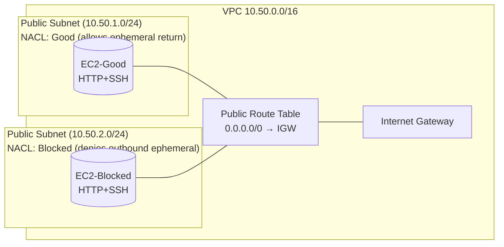

# Architecture

```mermaid
flowchart TB
  subgraph VPC["VPC 10.50.0.0/16"]
    subgraph PubGood["Public Subnet (10.50.1.0/24)\nNACL: Good (allows ephemeral return)"]
      EC2G[(EC2-Good<br/>HTTP+SSH)]
    end
    subgraph PubBlocked["Public Subnet (10.50.2.0/24)\nNACL: Blocked (denies outbound ephemeral)"]
      EC2B[(EC2-Blocked<br/>HTTP+SSH)]
    end
    IGW[Internet Gateway]
    RT[Public Route Table<br/>0.0.0.0/0 → IGW]
  end

  EC2G --- RT
  EC2B --- RT
  RT --- IGW
```
